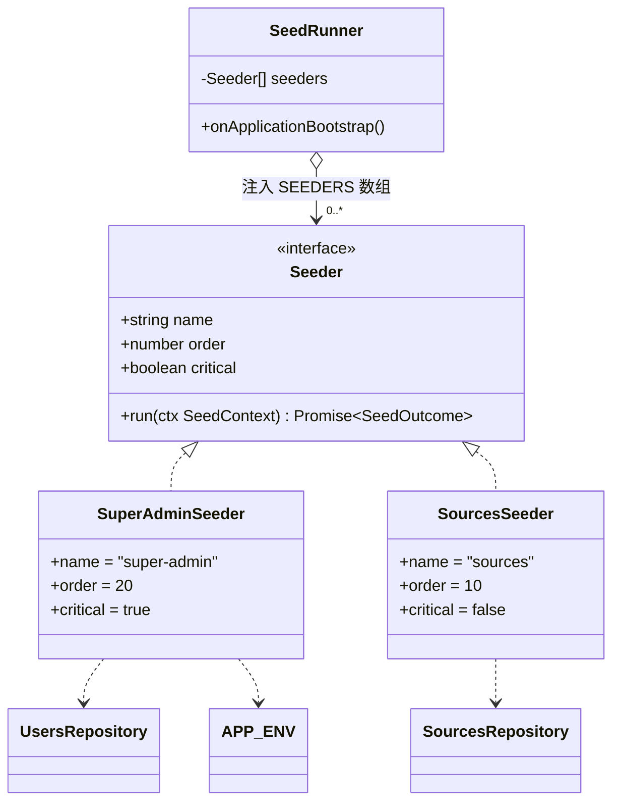
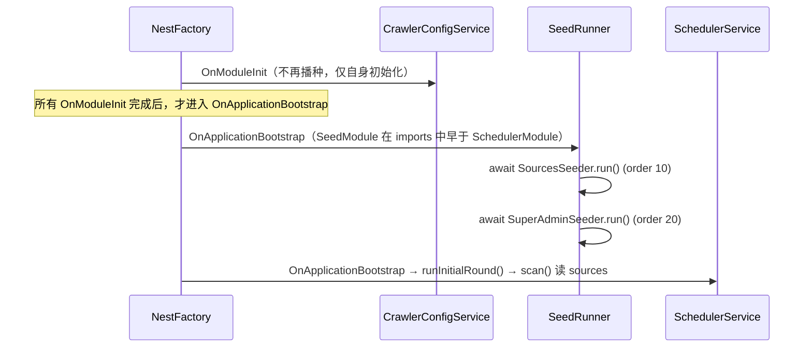

# 种子机制重构设计（统一编排 + 领域 Seeder 策略）

> 把当前**散落在两处、挂在不同生命周期钩子上**的启动种子逻辑，收拢成一套统一机制：
> 一个 `Seeder` 策略接口 + 一个 `SeedRunner` 编排器，各领域种子是接口的独立实现。
> 单一入口、统一日志/错误语义、可发现、易扩展，同时各 Seeder 仍保持高内聚。
> 本文是落地前的设计方案。

- **状态**：✅ 已落地（2026-06-15）。实现时在原 super-admin / sources 两类之外，把上一步「运行期参数入库」的播种也收编为第三个 Seeder：`RuntimeSettingsSeeder`（`order=30`、`non-critical`，写 `app_settings` 默认值）。其余均按本设计落地。
  - **落地后补充（种子数据就近化）**：原 §2 把「数据取值」列为非目标，但随后应用户要求把来源种子值从 `config/feeds.ts`+`config/subreddits.ts` 迁入 **`seed/source-lists.ts`**（与 `SourcesSeeder` 同处），并删除二者；`crawler/rss.ts` 改用本地结构类型、不再依赖种子常量。故 §8 目录与 §9.2 的 `@/config/*` 引用路径以现码为准。运行期默认值仍随 `RuntimeSettingsService`（兼读库兜底）、超管仍随 env（密钥），是两个有硬理由的例外。
- **日期**：2026-06-15
- **范围**：`apps/server/src/seed/`（新增接口 + 编排器 + 两个 Seeder + 装配）、`apps/server/src/crawler/crawler-config.service.ts`（摘除种子职责）、`apps/server/src/app.module.ts`（固化模块顺序注释）、`apps/server/test/`（新增单测）
- **不在范围**：种子**数据**本身的取值（subreddit/RSS 列表仍来自现有 `config/` 常量，不改内容）；模型 provider / 连接器的运行期配置（无种子，见 [[runtime-config-design]]）；数据库表结构与迁移（种子不碰 schema）
- **关系**：账户种子源自 [[backend-consolidation-impl]]（账户权威收进 server）；数据源种子源自 [[runtime-config-design]]（来源入库、env 退役）；DI/import 约定见 [[server-import-alias-convention]] 与 [[server-nest-pg-refactor]]

---

## 1. 背景与现状

服务器启动时的种子初始化目前**分散在两个无关模块**，由两个不同的生命周期钩子触发，没有统一入口：

| 种子           | 位置                                                                                           | 钩子                     | 数据来源               | 幂等条件                | 失败后果（现状）              |
| -------------- | ---------------------------------------------------------------------------------------------- | ------------------------ | ---------------------- | ----------------------- | ----------------------------- |
| 首个超级管理员 | [`SeedService`](apps/server/src/seed/seed.service.ts)                                          | `OnApplicationBootstrap` | env（`SUPER_ADMIN_*`） | `users` 表空 + env 齐全 | 抛错 → **阻断启动**（合理）   |
| 数据来源列表   | [`CrawlerConfigService.seedSourcesIfEmpty`](apps/server/src/crawler/crawler-config.service.ts) | `OnModuleInit`           | 代码常量（`config/`）  | `sources` 表空          | 抛错 → **阻断启动**（不合理） |

### 1.1 三个具体问题

1. **可发现性差**。"启动到底播了什么种子"得翻两个模块才能拼齐；新人（及 grep）很难一眼定位。第一处叫 `SeedService` 在 `seed/` 模块，第二处叫 `seedSourcesIfEmpty` 藏在 `crawler-config.service.ts` 里，命名与位置都不对齐。

2. **职责混入**。`CrawlerConfigService` 的本职是「按 DB 连接器构建 Reddit 客户端 + 连通性测试 + 指纹缓存」，种子只是搭车塞进了它的 `onModuleInit`。一个运行期配置服务不该背一次性引导逻辑。

3. **失败语义不一致且其中一处是错的**。数据源种子放在 `onModuleInit` 里——`onModuleInit` 抛错会**中止整个应用启动**。但「默认来源没播种成功」根本不该阻止系统起来（来源完全可以事后在设置页配）。现状把一个 non-critical 的种子当成了 critical。

### 1.2 一个非显而易见的时序约束（收拢必须正面处理）

`SchedulerService.onApplicationBootstrap()` 启动后会跑一次初始轮 `runInitialRound()`，其中 `scan()` 直接读 `sources` 表（[scheduler.service.ts:145](apps/server/src/scheduler/scheduler.service.ts) `listEnabledByPlatform(...)`）。

数据源种子**当前放在 `OnModuleInit`**，并非随意——NestJS 保证**所有模块的 `OnModuleInit` 都完成后**，才开始触发任何 `OnApplicationBootstrap`。于是「`OnModuleInit` 里的 sources 种子」**必然早于**「`OnApplicationBootstrap` 里的 scheduler 初始轮」。这是现状能开箱即抓的隐含原因。

> ⚠️ 收拢时若把数据源种子也挪到 `OnApplicationBootstrap`，就失去了这个全局屏障，必须用别的手段保住「种子先于初始轮」。§7 专门处理。**好消息**：经核对，这只是**体验优化**（避免首启第一轮空跑），不是正确性要求——`scan()` 读到空 `sources` 只是这一轮不抓东西，30 分钟后的 cron tick 会自愈。

### 1.3 一个让收拢更干净的事实

数据源种子依赖的 `SUBREDDITS` / `HN_SECTIONS` / `RSS_FEEDS` 是 **`apps/server/src/config/` 下的公共常量文件**，并非 `CrawlerModule` 私有。因此把数据源种子抽成独立 `Seeder` **不会**把 crawler 的领域知识"泄漏"出来——它依赖的只是公共常量 + `SourcesRepository`（在全局 `RepositoriesModule`）。这意味着 `SourcesSeeder` 可以干净地住进 `seed/` 模块，无需反向依赖 `CrawlerModule`。

---

## 2. 目标与非目标

**目标**

- G1：**单一入口**——所有种子在一个 `SeedRunner` 里按序驱动，一处即可看全。
- G2：**统一契约**——每个种子是 `Seeder` 接口的实现，幂等自查、返回结构化结果、声明失败语义。
- G3：**正确的失败语义**——critical 种子失败阻断启动，non-critical 种子失败仅告警放行（修复 §1.1 问题 3）。
- G4：**保住时序**——种子（尤其 sources）先于 scheduler 初始轮完成（§7）。
- G5：**易扩展**——新增一类种子 = 新增一个 `Seeder` 实现 + 在一处登记，不碰其它模块。
- G6：**高内聚不牺牲**——编排统一，但每个种子的逻辑/依赖各自封装在自己的类里。

**非目标**

- 不改任何种子**数据内容**（subreddit/RSS 列表照旧）。
- 不引入第三方 seeding 库（§10 解释为何自实现）。
- 不做开发用的「测试数据填充 / factory」——本机制只管**生产可用的幂等引导种子**。
- 不引入 CLI 手动 reseed（留作未来扩展，§11）。

---

## 3. 核心设计决策摘要

| #   | 决策             | 取值                                                                                                       | 理由 / 来源                                |
| --- | ---------------- | ---------------------------------------------------------------------------------------------------------- | ------------------------------------------ |
| S1  | 统一抽象         | 定义 `Seeder` 策略接口：`name` / `order` / `critical` / `run(ctx)`                                         | 策略模式（Strategy），见 §3.1 prior art    |
| S2  | 统一编排         | `SeedRunner` 实现 `OnApplicationBootstrap`，按 `order` 串行驱动全部 `Seeder`                               | 单一入口 / 可发现性（G1）                  |
| S3  | 收集方式         | `SeedModule` 内用 `useFactory` 聚合成 `SEEDERS` 数组注入 runner                                            | NestJS **不支持** Angular 式 `multi`，§6.3 |
| S4  | 幂等归属         | 各 `Seeder` 内部自查前置（表空 / env 齐），返回 `seeded \| skipped`；runner 不掺和幂等                     | 幂等条件各异，应就近封装                   |
| S5  | 失败语义         | `Seeder.critical`：账户种子 `true`（失败中止启动）、数据源种子 `false`（失败 warn 放行）                   | 修复现状误杀启动（§1.1-3）                 |
| S6  | 触发时机         | runner 用 `OnApplicationBootstrap`；靠 `imports` 顺序（`SeedModule` 早于 `SchedulerModule`）保证早于初始轮 | 语义贴切 + 顺序可控，§7                    |
| S7  | 顺序兜底         | 即便顺序被破坏，`scan()` 本就容忍空 `sources`，最坏首启空跑一轮、cron 自愈（非正确性问题）                 | 降低脆弱性，§7                             |
| S8  | 时间一致         | runner 启动时取一次 `nowSec()`，经 `SeedContext.now` 下传全部 Seeder                                       | 时间戳一致 + 便于测试注入                  |
| S9  | 自实现不引库     | 约 50 行手写，不引 `nestjs-seeder` 等                                                                      | 与项目「自写而非引库」风格一致，§10        |
| S10 | 不走 Prisma seed | 用 NestJS 生命周期而非 `prisma db seed`                                                                    | 种子需 DI / 加密 / repository，§10         |

### 3.1 主流范式佐证

「一个 Seeder 接口 + 一个 runner 按序调用」是各生态成熟 seeding 方案的通用形态：

- **Laravel** `DatabaseSeeder` 在 `run()` 里 `$this->call([UserSeeder::class, ...])`
- **Rails** `db/seeds.rb` 顺序执行幂等 `find_or_create_by`
- **TypeORM**（`typeorm-extension`）`Seeder` 接口 + `runSeeders()`
- **nestjs-seeder** `Seeder` 接口（`seed()` / `drop()`）+ `seeder()` runner

本设计是这一范式在「NestJS + Prisma + 幂等生产引导」语境下的最小落地，并补上**失败语义分级**与**启动时序契约**两个本项目特有的关注点。

---

## 4. 架构总览



- **策略**：`Seeder` 接口 + 各领域实现。
- **编排器**：`SeedRunner` 注入「全部 Seeder 的数组」，排序后串行执行，统一日志/错误/时间。
- **装配**：`SeedModule` 用 `useFactory` 把各 Seeder 聚合进 `SEEDERS` 令牌，注入 runner。

---

## 5. 契约定义（`seed/seeder.ts`）

```ts
// apps/server/src/seed/seeder.ts
import { nowSec } from '@/utils/time';

/** 一次启动内统一下传给所有 Seeder 的上下文（当前仅时间，预留扩展位） */
export interface SeedContext {
  /** 本次启动只取一次的 Unix 秒：保证同批种子时间戳一致，且单测可注入 */
  readonly now: number;
}

/** 单个 Seeder 的执行结果（结构化，供 runner 统一记录） */
export type SeedOutcome =
  | { status: 'seeded'; detail: string } // 实际写入了数据
  | { status: 'skipped'; reason: string }; // 幂等命中 / 前置不满足，未写入

/**
 * 种子策略：一类启动引导数据的幂等播种器。
 * 实现须保证 run() 幂等（可安全重复调用）——幂等判断在实现内部完成。
 */
export interface Seeder {
  /** 稳定标识，用于日志与排序追溯（kebab-case） */
  readonly name: string;
  /** 执行顺序，小者先；无依赖关系的可同值（同值间顺序不保证） */
  readonly order: number;
  /** 失败是否阻断启动：true → 向上抛中止 bootstrap；false → 记 warn 后继续下一个 */
  readonly critical: boolean;
  /** 幂等播种。内部自查前置（表空 / 配置齐全），返回本次结果 */
  run(ctx: SeedContext): Promise<SeedOutcome>;
}

/** 注入令牌：聚合后的「全部 Seeder 数组」（见 SeedModule 的 useFactory） */
export const SEEDERS = Symbol('SEEDERS');
```

> 放在 `common/tokens.ts` 还是就近？`SEEDERS` 只在 `seed/` 内部使用、不跨模块共享，故与接口同文件即可（对比 `APP_ENV`/`PRISMA` 是跨模块共享才单独成 `tokens.ts`）。

---

## 6. 编排器与装配

### 6.1 `SeedRunner`（`seed/seed.runner.ts`）

```ts
// apps/server/src/seed/seed.runner.ts
import { Inject, Injectable, type OnApplicationBootstrap } from '@nestjs/common';
import { logger } from '@/logger';
import { nowSec } from '@/utils/time';
import { SEEDERS, type Seeder, type SeedContext } from './seeder';

/**
 * 种子编排器：启动时按 order 串行驱动全部 Seeder（唯一入口）。
 * - 统一时间（一次 nowSec 下传）、统一日志、统一失败语义
 * - critical 失败 → 向上抛中止启动；non-critical 失败 → warn 后继续
 */
@Injectable()
export class SeedRunner implements OnApplicationBootstrap {
  constructor(@Inject(SEEDERS) private readonly seeders: readonly Seeder[]) {}

  async onApplicationBootstrap(): Promise<void> {
    const ctx: SeedContext = { now: nowSec() };
    const ordered = [...this.seeders].sort((a, b) => a.order - b.order);
    for (const seeder of ordered) {
      try {
        const outcome = await seeder.run(ctx);
        if (outcome.status === 'seeded') {
          logger.info(`[seed] ${seeder.name}：${outcome.detail}`);
        } else {
          logger.debug(`[seed] ${seeder.name} 跳过：${outcome.reason}`);
        }
      } catch (err) {
        const msg = err instanceof Error ? err.message : String(err);
        if (seeder.critical) {
          logger.error(`[seed] ${seeder.name} 失败（critical），中止启动：${msg}`);
          throw err;
        }
        logger.warn(`[seed] ${seeder.name} 失败（non-critical），已跳过：${msg}`);
      }
    }
  }
}
```

### 6.2 模块装配（`seed/seed.module.ts`）

```ts
// apps/server/src/seed/seed.module.ts
import { Module } from '@nestjs/common';
import { RepositoriesModule } from '@/db/repositories.module';
import { SEEDERS, type Seeder } from './seeder';
import { SeedRunner } from './seed.runner';
import { SourcesSeeder } from './sources.seeder';
import { SuperAdminSeeder } from './super-admin.seeder';

/**
 * 种子模块：启动时统一编排全部幂等引导种子（见 SeedRunner）。
 * 新增一类种子：① 写一个实现 Seeder 的类 ② 加进下方 providers 与 SEEDERS 的 inject 列表。
 */
@Module({
  imports: [RepositoriesModule], // 提供 UsersRepository / SourcesRepository（APP_ENV 由全局 AppConfigModule 提供）
  providers: [
    SuperAdminSeeder,
    SourcesSeeder,
    {
      // NestJS 不支持 Angular 式 `multi: true`，故用 useFactory 把各 Seeder 聚合成数组
      provide: SEEDERS,
      useFactory: (...seeders: Seeder[]) => seeders,
      inject: [SourcesSeeder, SuperAdminSeeder], // ← 新增 Seeder 时在此登记
    },
    SeedRunner,
  ],
})
export class SeedModule {}
```

### 6.3 为什么是 `useFactory` 聚合，而不是 `multi` provider？

这是落地的关键正确性点，也是给正在学 NestJS 的同学的一个坑位提醒（对比 Angular / Midway）：

- **Angular** 有 `{ provide: TOKEN, useClass: X, multi: true }`，同一令牌可多次注册、注入时自动合并成数组。**NestJS 没有这个特性**——重复 `provide` 同一令牌会相互覆盖，不会合并。
- **Midway** 习惯靠 `@Provide()` + 自动扫描收集一类实现；NestJS 的 DI 是**显式模块装配**，没有等价的全局自动收集（除非用下面的 DiscoveryService）。
- 因此 NestJS 里「注入一组同类 provider」的惯用法是 **`useFactory` + `inject` 数组**：把各 provider 注入工厂、原样组成数组返回。显式、类型安全、零反射。新增 Seeder 只动 `inject` 一处。

**进阶备选（不在本期范围）**：若未来 Seeder 大量增加、希望「加文件即自动收集、完全开闭」，可换用 `@nestjs/core` 的 **`DiscoveryService`** + 自定义 `@Seeder()` 装饰器，在 runner 里反射扫描所有带标记的 provider。代价是引入元数据反射、稍隐式。当前仅 2 个种子，显式聚合更划算——**先不上 DiscoveryService**。

---

## 7. 启动时序与生命周期契约（重点）

### 7.1 目标时序



### 7.2 怎么保证「种子先于 scheduler 初始轮」

收拢后 sources 种子从 `OnModuleInit` 迁到 `OnApplicationBootstrap`，靠三条共同保证：

1. **NestJS 串行 await `OnApplicationBootstrap`**：按模块初始化（拓扑 + 注册）顺序逐个 await。
2. **`SeedModule` 在 `app.module.ts` 的 `imports` 中早于 `SchedulerModule`**（当前已满足：索引 4 vs 9）。
3. **`SeedRunner` 内部 `await` 完所有 Seeder** 才返回，故其钩子返回时种子已落库。

> 落地动作：在 [app.module.ts](apps/server/src/app.module.ts) 的 `imports` 处补一行注释，把「`SeedModule` 必须排在 `SchedulerModule` 之前」固化为显式约定，防止后人调序踩坑。

### 7.3 兜底：即便顺序被破坏也不出错

这条让我们不必为时序引入脆弱的强耦合：`scan()` 读 `listEnabledByPlatform(...)` 得到空数组时，只是这一轮不抓任何来源，**不抛错**；30 分钟后的 cron tick 时种子早已落库，自然恢复。所以顺序保证保护的是**首启第一轮的体验**（不空跑），而非数据正确性。

### 7.4 为何选 `OnApplicationBootstrap` 而非统一到 `OnModuleInit`

| 方案                               | 顺序保证                       | 语义                             | 取舍                             |
| ---------------------------------- | ------------------------------ | -------------------------------- | -------------------------------- |
| **`OnApplicationBootstrap`（选）** | 靠 imports 顺序 + §7.3 兜底    | 「应用就绪后做一次性引导」最贴切 | 与主流 seeder 框架一致；**采用** |
| `OnModuleInit`                     | 最强（全局屏障，必早于初始轮） | 「模块依赖就绪」语义偏弱         | 顺序硬，但语义不如前者；作为备选 |

若团队更看重「顺序硬保证」而非语义贴切，把 `SeedRunner` 改实现 `OnModuleInit` 即可，其余设计不变——这是一个**单点可切换**的决策。默认推荐 `OnApplicationBootstrap`。

---

## 8. 目录结构

平铺在 `seed/` 下（子目录引接口用同目录 `./`，符合 [[server-import-alias-convention]]）：

```
apps/server/src/seed/
├── seeder.ts            # Seeder 接口 + SeedContext + SeedOutcome + SEEDERS 令牌
├── seed.runner.ts       # 编排器（OnApplicationBootstrap）
├── super-admin.seeder.ts# 账户种子（从旧 seed.service.ts 搬入）
├── sources.seeder.ts    # 数据源种子（从 crawler-config.service.ts 搬入）
└── seed.module.ts       # 装配
```

旧文件 `seed/seed.service.ts` 删除（逻辑迁入 `super-admin.seeder.ts`）。

---

## 9. 两个 Seeder 的落地草图

### 9.1 `SuperAdminSeeder`（搬自 `seed.service.ts`）

```ts
// apps/server/src/seed/super-admin.seeder.ts
import { Inject, Injectable } from '@nestjs/common';
import { hashPassword } from '@hatch-radar/auth';
import { APP_ENV } from '@/common/tokens';
import type { AppEnv } from '@/config/env';
import { UsersRepository } from '@/db/users.repository';
import type { Seeder, SeedContext, SeedOutcome } from './seeder';

/** 首个超级管理员（幂等）：仅当 users 表空且设置了 SUPER_ADMIN_* 时创建，首登强制改密。 */
@Injectable()
export class SuperAdminSeeder implements Seeder {
  readonly name = 'super-admin';
  readonly order = 20;
  readonly critical = true; // 配了超管却建不出来 → 系统登录不了，应 fail fast

  constructor(
    @Inject(APP_ENV) private readonly env: AppEnv,
    private readonly users: UsersRepository,
  ) {}

  async run(ctx: SeedContext): Promise<SeedOutcome> {
    const sa = this.env.superAdmin;
    if (!sa) return { status: 'skipped', reason: '未设置 SUPER_ADMIN_EMAIL/PASSWORD' };
    if ((await this.users.count()) > 0) return { status: 'skipped', reason: 'users 表非空' };
    await this.users.create(
      {
        email: sa.email,
        name: '超级管理员',
        passwordHash: await hashPassword(sa.password),
        role: 'super_admin',
        mustChangePassword: true,
        createdBy: null,
        permissions: [],
        grantedBy: null,
      },
      ctx.now,
    );
    return { status: 'seeded', detail: `已创建首个超级管理员 ${sa.email}（首登强制改密）` };
  }
}
```

### 9.2 `SourcesSeeder`（搬自 `crawler-config.service.ts`）

```ts
// apps/server/src/seed/sources.seeder.ts
import { Injectable } from '@nestjs/common';
import { HN_SECTIONS, RSS_FEEDS } from '@/config/feeds';
import { SUBREDDITS } from '@/config/subreddits';
import { SourcesRepository } from '@/db/sources.repository';
import type { Seeder, SeedContext, SeedOutcome } from './seeder';

/** 首启来源列表（幂等）：sources 表空时把代码常量写入，保证开箱即有默认监控面。仅来源列表，不含凭据。 */
@Injectable()
export class SourcesSeeder implements Seeder {
  readonly name = 'sources';
  readonly order = 10; // 早于 super-admin，亦确保（同钩子内）先于 scheduler 初始轮取数
  readonly critical = false; // 来源可事后在设置页配，播种失败不应阻断启动

  constructor(private readonly sources: SourcesRepository) {}

  async run(ctx: SeedContext): Promise<SeedOutcome> {
    if ((await this.sources.countSources()) > 0) {
      return { status: 'skipped', reason: 'sources 表非空' };
    }
    for (const sub of SUBREDDITS) {
      await this.sources.createSource(
        {
          platform: 'reddit',
          identifier: sub,
          label: sub,
          config: { sorts: ['hot', 'new'], limit: 25 },
        },
        ctx.now,
      );
    }
    for (const hn of HN_SECTIONS) {
      await this.sources.createSource(
        { platform: 'hackernews', identifier: hn.endpoint, label: hn.channel },
        ctx.now,
      );
    }
    for (const feed of RSS_FEEDS) {
      await this.sources.createSource(
        { platform: 'rss', identifier: feed.url, label: feed.name },
        ctx.now,
      );
    }
    return {
      status: 'seeded',
      detail: `reddit ${SUBREDDITS.length} / hackernews ${HN_SECTIONS.length} / rss ${RSS_FEEDS.length}`,
    };
  }
}
```

### 9.3 `CrawlerConfigService` 的摘除

移除 `OnModuleInit` 实现与 `seedSourcesIfEmpty()`（连同对 `@/config/feeds`、`@/config/subreddits`、`nowSec` 的相关 import 若不再使用）。该服务回归纯粹的「运行期 Reddit 客户端构建 + 连通性测试」职责：

```ts
// 改造前：implements OnModuleInit { async onModuleInit() { await this.seedSourcesIfEmpty() } ... }
// 改造后：class CrawlerConfigService { /* 不再实现 OnModuleInit，删除 seedSourcesIfEmpty */ }
```

> 注意 `SourcesRepository` 在 `CrawlerConfigService` 的构造器里若仅被种子用到则可一并移除；当前代码中它只被 `seedSourcesIfEmpty` 使用，故可从构造器删去（让依赖更精确）。落地时按编译器提示确认。

---

## 10. 不选的方案及理由

- **Prisma 官方 seed（`prisma/seed.ts` + `prisma db seed`）**：它脱离 NestJS DI 容器，拿不到 `UsersRepository` / `hashPassword`（scrypt）/ `APP_ENV` / 加密工具，且更适合「开发期填充测试数据」而非「生产运行期幂等引导」。本项目种子需要 DI 与业务能力，故走 NestJS 生命周期。**项目里也因此没有 `prisma/seed.ts`**，本设计维持这一点。
- **纯分布式 `multi` provider（各 feature 模块自注册）**：NestJS 不支持 `multi`，跨模块聚合需绕路且行为隐晦；当前规模用集中 `useFactory` 更稳更显式（§6.3）。
- **第三方 `nestjs-seeder` 等库**：约 50 行即可自实现，且本项目偏好自写可控（参见自写 ESLint 规则的先例，[[server-import-alias-convention]]）。引库反而增加依赖面与认知成本。
- **DiscoveryService 自动发现**：开闭性好但引入反射、偏隐式；2 个种子用不上，列为未来升级路径（§11）。

---

## 11. 未来扩展

- **新增一类种子**（如默认分析模板 / 默认标签 / 默认提示词）：① 新建 `xxx.seeder.ts` 实现 `Seeder`；② 在 `SeedModule` 的 `providers` 与 `SEEDERS` 的 `inject` 各加一行。其余零改动。
- **CLI 手动 reseed / drop**：`SeedRunner` 的编排逻辑可被一个 `NestFactory.createApplicationContext()` 的独立脚本复用，做 `pnpm seed:run` 之类的手动触发（接口可加可选 `drop()`）。
- **开闭式自动收集**：种子数量上规模后，迁到 `DiscoveryService` + `@Seeder()` 装饰器，去掉手工 `inject` 列表。
- **依赖式排序**：`order` 数字若不够用，可升级为 `dependsOn: string[]` 做拓扑排序。当前 2 个种子无需。

---

## 12. 测试策略

沿用 `apps/server/test/*.spec.ts`（vitest）。

- **`super-admin.seeder.spec.ts`**：env 缺失 → `skipped`；users 非空 → `skipped`；空库 + env 齐 → `seeded` 且 `users.create` 入参正确（role/mustChangePassword/passwordHash 已 hash）；连跑两次第二次 `skipped`（幂等）。
- **`sources.seeder.spec.ts`**：空表 → 写入 `SUBREDDITS+HN_SECTIONS+RSS_FEEDS` 条且 `detail` 计数正确；非空 → `skipped`；幂等复跑。
- **`seed.runner.spec.ts`**：按 `order` 升序调用（mock 两个乱序 Seeder，断言调用次序）；`critical` Seeder 抛错 → runner 向上抛、后续不执行；`non-critical` 抛错 → 吞掉并继续后续；`ctx.now` 对所有 Seeder 同值。
- 可在原有「启动冒烟」流程里确认日志出现两条 `[seed]`。

---

## 13. 落地步骤（Checklist）

1. 新增 [seeder.ts](apps/server/src/seed/seeder.ts)：`Seeder` / `SeedContext` / `SeedOutcome` / `SEEDERS`。
2. 新增 [super-admin.seeder.ts](apps/server/src/seed/super-admin.seeder.ts)：搬入旧 `SeedService` 逻辑，实现 `Seeder`（`critical=true, order=20`）。
3. 新增 [sources.seeder.ts](apps/server/src/seed/sources.seeder.ts)：搬入 `seedSourcesIfEmpty` 逻辑，实现 `Seeder`（`critical=false, order=10`）。
4. 新增 [seed.runner.ts](apps/server/src/seed/seed.runner.ts)：`SeedRunner`（`OnApplicationBootstrap`，排序串行 + 失败语义 + 统一时间/日志）。
5. 改写 [seed.module.ts](apps/server/src/seed/seed.module.ts)：`providers` 登记两个 Seeder + `SEEDERS` 工厂 + `SeedRunner`；删除旧 `SeedService`。
6. 删除 [seed.service.ts](apps/server/src/seed/seed.service.ts)。
7. 改 [crawler-config.service.ts](apps/server/src/crawler/crawler-config.service.ts)：移除 `OnModuleInit` 与 `seedSourcesIfEmpty`，并清理只为种子存在的构造器依赖 / import。
8. 在 [app.module.ts](apps/server/src/app.module.ts) 的 `imports` 处补注释：固化「`SeedModule` 须早于 `SchedulerModule`」。
9. 新增三个 spec（§12）。
10. 验证：`pnpm typecheck` + 测试 + 启动冒烟（确认空库播种、复跑跳过、日志正确）。

---

## 14. 影响文件清单

| 文件                                                                                             | 动作                                   |
| ------------------------------------------------------------------------------------------------ | -------------------------------------- |
| `apps/server/src/seed/seeder.ts`                                                                 | 新增（接口 + 令牌 + 类型）             |
| `apps/server/src/seed/seed.runner.ts`                                                            | 新增（编排器）                         |
| `apps/server/src/seed/super-admin.seeder.ts`                                                     | 新增（搬自 seed.service.ts）           |
| `apps/server/src/seed/sources.seeder.ts`                                                         | 新增（搬自 crawler-config.service.ts） |
| `apps/server/src/seed/seed.module.ts`                                                            | 改写（装配）                           |
| `apps/server/src/seed/seed.service.ts`                                                           | 删除                                   |
| `apps/server/src/crawler/crawler-config.service.ts`                                              | 改（摘除种子职责）                     |
| `apps/server/src/app.module.ts`                                                                  | 改（顺序注释）                         |
| `apps/server/test/super-admin.seeder.spec.ts` / `sources.seeder.spec.ts` / `seed.runner.spec.ts` | 新增（单测）                           |

> 数据层（`UsersRepository.count/create`、`SourcesRepository.countSources/createSource`）零改动——种子机制只是重新组织调用方，不触碰仓储与 schema。
